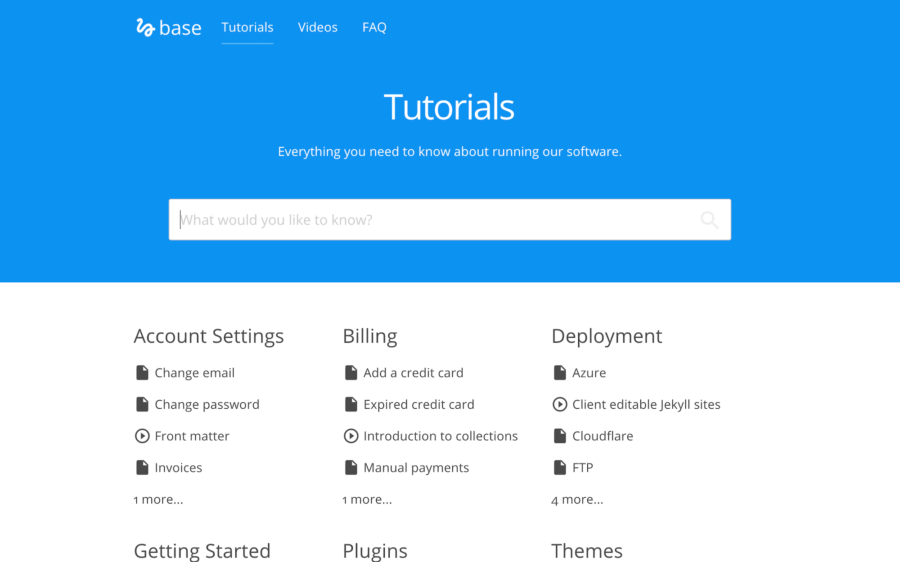

# Mconf Docs

## Develop

Base was built with [Jekyll](http://jekyllrb.com/).

Install the dependencies with [Bundler](http://bundler.io/):

~~~bash
$ bundle install
~~~

Run `jekyll` commands through Bundler to ensure you're using the right versions:

~~~bash
$ bundle exec jekyll serve
~~~

## Editing

The sticky sidebar in tutorials in populated by pulling out `<h2>` elements from the content.

### Posts

* Add, update or remove a post in the *Posts* collection.
* The tutorials page is organised by categories.
* Change the defaults when new posts are created in `_posts/_defaults.md`.

### Post Series
To create a new series:

* Add a new document to the `sets` collection.
* Set the `title` and `description`.

To add a tutorial/post to a series:
* Add a `set` field to the tutorial front matter which points to the file name of the desired set without the `.md` extention. e.g. If I have a set at `_sets/getting-started.md` I would use this in my tutorial front matter: `set: getting-started`.
* Add a `set_order` field to the tutorial front matter and specify a number. This is the tutorials order in the set.

### Navigation

* Exposed as a data file to give clients better access.
* Set in the *Data* / *Navigation* section.

### Footer

* Exposed as a data file to give clients better access.
* Set in the *Data* / *Footer* section.

## TODOs

In the content:

* How to contribute
* About Mconf-Live installation (`/getting started/mconf-live/mconf-live/`)
* Mconf-Live troubleshooting (`/mconf-live/faq/mconf-live-faq/`)
* Mconf-Live installation (`/mconf-live/installation/mconf-live-installing/`)
* Differences between Mconf-Live and BigBlueButton
* Change log and version tracking for Mconf-Live and Mconf-Web (what is the latest version, based on which BigBlueButton, where to find it)
* Pages about the customizations in the plugins for Moodle
* Pages with the current roadmap for all components, even if just a high level description

In the docs website:

* Update this readme
* Warn/alert sections to use on pages with important information
* Better ordering, some articles are way more important than others (use colors? pinned posts?)

# Template

Knowledge base template for Jekyll. Browse through a [live demo](https://orange-ape.cloudvent.net/).

Base was made by [CloudCannon](http://cloudcannon.com/), the Cloud CMS for Jekyll.
Find more templates and themes at [Jekyll Tips](https://learn.cloudcannon.com/jekyll-templates/).

Learn Jekyll with step-by-step tutorials and videos at [CloudCannon Academy](https://learn.cloudcannon.com/).
